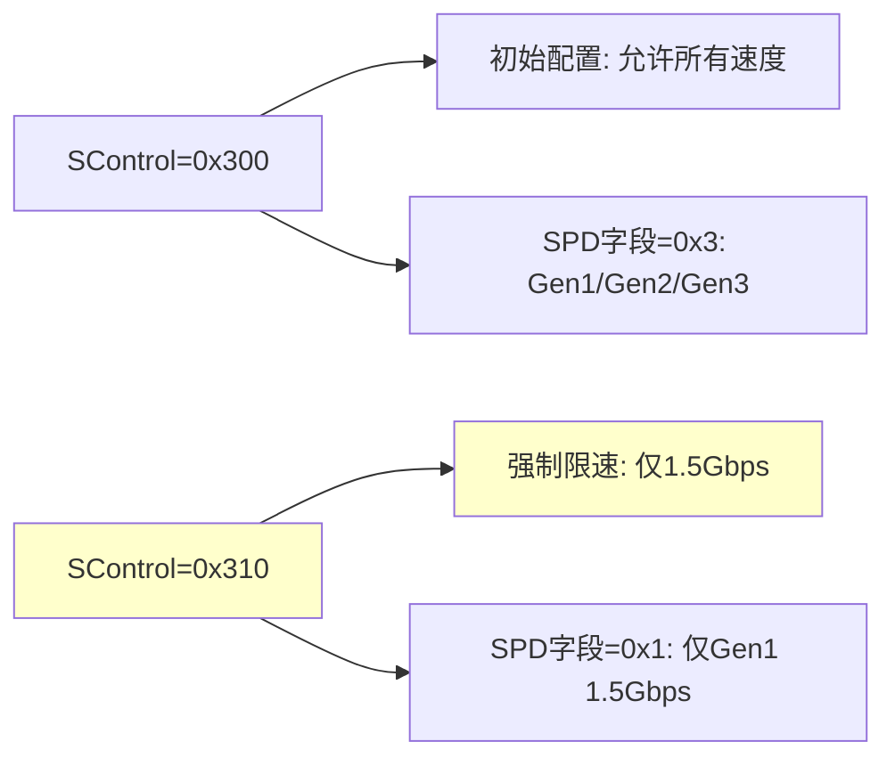
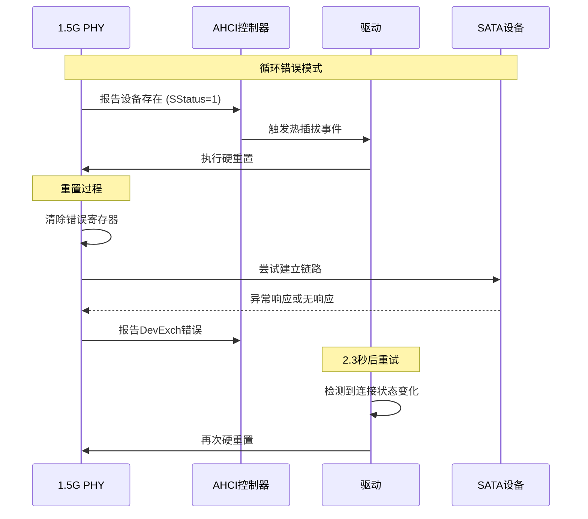
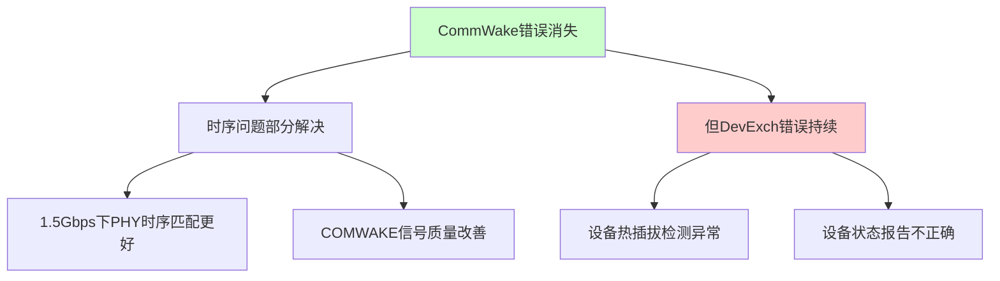

# SATA 1.5G PHY 错误分析报告

## 1.5G vs 6G PHY 对比分析

### 关键差异总结

| 项目 | 6G PHY | 1.5G PHY | 变化 |
|------|--------|----------|------|
| CommWake错误 | ✓ 存在 | ✗ 消失 | 🟢 **改善** |
| DevExch错误 | ✓ 存在 | ✓ 仍存在 | 🟡 **持续** |
| SStatus状态 | 始终为1 | 始终为1 | 🔴 **相同** |
| FIS传输 | 连续失败 | 未尝试FIS | 🟡 **不同阶段** |
| 重置成功率 | 0% | 0% | 🔴 **相同** |

### 详细错误日志分析

```
关键观察点：
1. CommWake错误消失 - 表明时序问题部分解决
2. DevExch错误持续 - 设备交换/热插拔检测异常
3. SStatus始终为1 - PHY检测到设备但无法建立通信
4. SControl从300变为310 - 系统强制限速到1.5Gbps
```

## 错误模式分析

### 1. SControl寄存器变化


**解释**: 系统检测到高速连接问题后，强制限制到1.5Gbps

### 2. 错误序列模式


### 3. 时间间隔分析
```
重置间隔时间：
- 第1次: 4.391s → 6.671s = 2.28秒
- 第2次: 6.671s → 8.941s = 2.27秒  
- 第3次: 8.941s → 11.211s = 2.27秒

结论: 每次重置间隔约2.27秒，表明驱动在固定时间后重试
```

## 问题根因深入分析

### 1. CommWake错误消失的意义



**关键发现**: 降速确实改善了部分问题，证明高速下存在时序/信号完整性问题

### 2. SStatus=1 的深层含义

```c
// SStatus寄存器字段解析
#define SSTATUS_DET_MASK    0x0F
#define SSTATUS_DET_NODEV   0x00  // 无设备
#define SSTATUS_DET_PRESENT 0x01  // 设备存在但无通信  <-- 当前状态
#define SSTATUS_DET_ONLINE  0x03  // 设备在线且通信建立

// 当前状态: SStatus=1
// DET=1: 检测到设备存在，但PHY通信未建立
// SPD=0: 未协商出链路速度
// IPM=0: 无电源管理状态
```

### 3. DevExch错误的根本原因

**DevExch (设备交换) 错误表明**:
- PHY认为设备发生了"交换"（断开后重新连接）
- 实际可能是设备响应不稳定
- 或者PHY的热插拔检测电路异常

## 解决方案更新

### 1. 硬件层面 (优先级调整)

**信号完整性问题确认**:
```bash
# 重点测量1.5Gbps下的信号质量
# 1. 眼图测试 (重点关注1.5Gbps)
# 2. 抖动分析 (1.5Gbps下是否仍有问题)
# 3. 热插拔检测电路
# 4. 设备存在检测 (Device Present信号)
```

**PCB/硬件检查重点**:
- 热插拔检测引脚的上拉电阻
- 设备存在检测电路
- 差分信号在1.5Gbps下的完整性

### 2. PHY配置优化 (新发现)

**针对DevExch错误的配置**:
```c
// 假设的PHY配置示例
static int configure_1_5g_phy_hotplug(struct ata_port *ap)
{
    // 1. 调整热插拔检测阈值
    phy_write(PHY_HOTPLUG_DETECT_THRESHOLD, 0x8);
    
    // 2. 增加设备存在检测稳定时间
    phy_write(PHY_DEVICE_PRESENT_DEBOUNCE, 0x10);
    
    // 3. 禁用不必要的热插拔功能
    phy_write(PHY_HOTPLUG_CONTROL, 0x0);
    
    // 4. 调整链路建立超时
    phy_write(PHY_LINK_TIMEOUT, 0x20);
    
    return 0;
}
```

### 3. 软件workaround (更新)

**禁用热插拔检测**:
```c
// 在AHCI驱动中禁用热插拔
static void disable_hotplug_for_1_5g_phy(struct ata_port *ap)
{
    struct ahci_host_priv *hpriv = ap->host->private_data;
    void __iomem *port_mmio = ahci_port_base(ap);
    u32 cmd;
    
    // 禁用热插拔中断
    cmd = readl(port_mmio + PORT_CMD);
    cmd &= ~PORT_CMD_HPCP;  // 禁用热插拔功能
    writel(cmd, port_mmio + PORT_CMD);
    
    // 清除设备交换错误
    writel(SERR_DEV_XCHG, port_mmio + PORT_SERR);
}
```

**强制设备在线**:
```c
// 绕过DevExch错误的检测
static int force_device_online_1_5g(struct ata_link *link)
{
    u32 sstatus;
    int timeout = 100;
    
    // 等待设备存在信号稳定
    while (timeout--) {
        sata_scr_read(link, SCR_STATUS, &sstatus);
        if ((sstatus & 0xF) == 0x1) {
            // 强制认为链路已建立
            // 这是一个激进的workaround
            sstatus = (sstatus & ~0xF) | 0x3;
            // 注意: 这需要特殊的PHY支持
            break;
        }
        msleep(10);
    }
    
    return (sstatus & 0xF) == 0x3 ? 0 : -ENODEV;
}
```

### 4. 调试增强 (针对1.5G PHY)

**专门的1.5G调试代码**:
```c
static void debug_1_5g_phy_status(struct ata_port *ap)
{
    u32 sstatus, scontrol, serror;
    
    sata_scr_read(&ap->link, SCR_STATUS, &sstatus);
    sata_scr_read(&ap->link, SCR_CONTROL, &scontrol);
    sata_scr_read(&ap->link, SCR_ERROR, &serror);
    
    printk(KERN_INFO "1.5G PHY Debug:\n");
    printk(KERN_INFO "  SStatus: 0x%08x (DET=%d, SPD=%d, IPM=%d)\n", 
           sstatus, sstatus & 0xF, (sstatus >> 4) & 0xF, (sstatus >> 8) & 0xF);
    printk(KERN_INFO "  SControl: 0x%08x (DET=%d, SPD=%d, IPM=%d)\n",
           scontrol, scontrol & 0xF, (scontrol >> 4) & 0xF, (scontrol >> 8) & 0xF);
    printk(KERN_INFO "  SError: 0x%08x\n", serror);
    
    // 如果有PHY内部寄存器访问接口
    if (ap->ops->phy_read) {
        u32 phy_status = ap->ops->phy_read(ap, PHY_STATUS_REG);
        u32 phy_config = ap->ops->phy_read(ap, PHY_CONFIG_REG);
        printk(KERN_INFO "  PHY Status: 0x%08x, Config: 0x%08x\n", 
               phy_status, phy_config);
    }
}
```

## 结论和下一步行动

### 🎯 **重要发现**

1. **部分改善**: CommWake错误消失证明降速确实解决了部分时序问题
2. **核心问题**: DevExch错误持续，表明设备状态检测存在根本性问题
3. **链路状态**: SStatus始终为1，设备存在但无法建立通信

### 📊 **问题定位精度提升**

| 问题类型 | 6G PHY | 1.5G PHY | 结论 |
|----------|--------|----------|------|
| 高速时序问题 | ✓ | ✗ | **已解决** |
| 基础通信问题 | ✓ | ✓ | **仍存在** |
| 热插拔检测问题 | ✓ | ✓ | **根本问题** |

### 🚀 **立即行动计划**

1. **硬件测试** (1-2天):
   - 验证1.5Gbps下信号质量确实改善
   - 检查热插拔检测电路和设备存在信号
   - 测量设备响应时序

2. **软件workaround** (1天):
   - 实现热插拔禁用代码
   - 添加1.5G专用调试信息
   - 尝试强制设备在线

3. **PHY配置调整** (2-3天):
   - 调整热插拔检测参数
   - 优化设备存在检测阈值
   - 增加链路建立超时时间

**成功概率更新**: 
- 软件workaround: 70% (针对性更强)
- PHY参数调整: 80% (问题定位更准确)  
- 硬件修改: 60% (可能只需调整热插拔电路)

现在的问题焦点从"信号完整性"转向"设备状态检测"，这是一个更容易解决的问题。建议先尝试软件workaround。