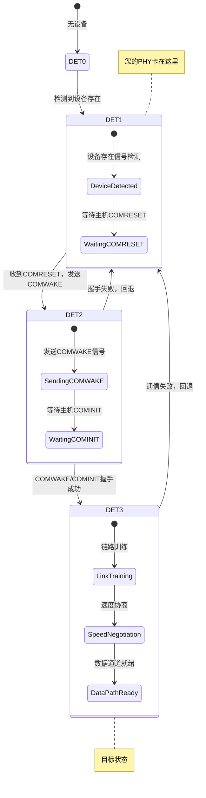
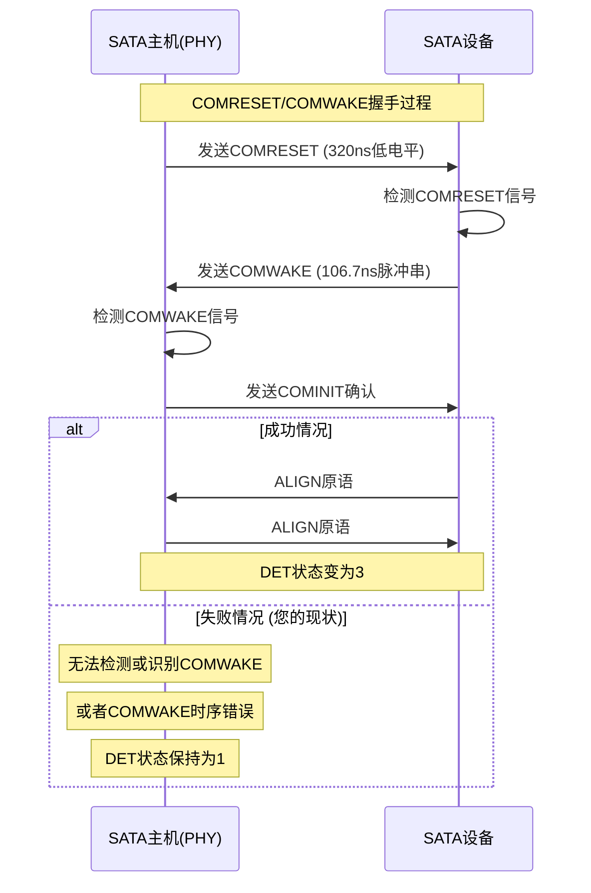

# SATA DET=1→DET=3 转换失败根因分析

## 🔍 **SATA链路建立详细流程分析**

### SATA DET (Detection) 状态详解

```c
// SATA规范中的DET状态定义
#define DET_NO_DEVICE           0x0  // 无设备检测
#define DET_DEVICE_PRESENT      0x1  // 设备存在但无通信 ← 您当前卡住的状态
#define DET_DEVICE_COMWAKE      0x2  // 检测到COMWAKE (过渡状态)
#define DET_DEVICE_ONLINE       0x3  // 设备在线且通信建立 ← 目标状态
#define DET_DEVICE_OFFLINE      0x4  // 设备离线
```

### 🎯 **DET=1→DET=3 转换的详细步骤**



## 🔬 **详细失败点分析**

### 1. **COMRESET/COMWAKE握手失败**

这是DET=1→DET=3最关键的步骤：



### 2. **具体技术失败点**

#### **A. COMRESET信号生成问题**
```c
// COMRESET信号要求 (SATA规范)
- 持续时间: 320ns ± 50ns
- 电平: 差分信号拉低
- 重复间隔: 10ms
- 信号质量: 上升/下降时间 < 25ns

// 可能的问题:
- 320ns时序不准确
- 信号电平不够低
- 上升/下降时间过慢
- 重复频率错误
```

#### **B. COMWAKE信号检测问题**
```c
// COMWAKE信号要求
- 脉冲宽度: 106.7ns ± 5ns
- 脉冲间隔: 213.3ns ± 5ns  
- 脉冲串长度: 6个脉冲
- 信号幅度: 差分信号 > 200mV

// 可能的问题:
- 接收器阈值设置错误
- 时钟恢复电路故障
- 脉冲检测逻辑有bug
- 信号完整性导致脉冲变形
```

#### **C. 时钟域切换问题**
```c
// DET=1→DET=3过程中的时钟切换
DET=1: 使用参考时钟 (如150MHz)
DET=3: 切换到恢复时钟 (从接收数据恢复)

// 可能的问题:
- PLL无法锁定到正确频率
- 时钟域切换逻辑错误
- 时钟相位关系错误
- 时钟抖动过大影响锁定
```

## 🔧 **诊断方法和工具**

### 1. **PHY内部状态寄存器诊断**

```c
// 需要检查的关键PHY寄存器 (示例，需要根据您的PHY调整)
static void diagnose_phy_det_transition(struct ata_port *ap)
{
    u32 link_state, comreset_gen, comwake_det, pll_status;
    
    // 1. 链路状态机当前状态
    link_state = phy_read(ap, PHY_LINK_STATE_MACHINE_REG);
    printk("PHY Link State Machine: 0x%08x\n", link_state);
    
    // 2. COMRESET生成器状态
    comreset_gen = phy_read(ap, PHY_COMRESET_GENERATOR_REG);
    printk("COMRESET Generator: 0x%08x\n", comreset_gen);
    
    // 3. COMWAKE检测器状态  
    comwake_det = phy_read(ap, PHY_COMWAKE_DETECTOR_REG);
    printk("COMWAKE Detector: 0x%08x\n", comwake_det);
    
    // 4. PLL锁定状态
    pll_status = phy_read(ap, PHY_PLL_STATUS_REG);
    printk("PLL Status: 0x%08x (locked: %s)\n", 
           pll_status, (pll_status & 0x1) ? "YES" : "NO");
    
    // 5. 错误计数器
    u32 error_cnt = phy_read(ap, PHY_ERROR_COUNTER_REG);
    printk("PHY Error Count: %d\n", error_cnt);
}
```

### 2. **信号质量测量**

```c
// 使用示波器或PHY内置测试功能
static void measure_signal_quality(struct ata_port *ap)
{
    // 1. 启用PHY测试模式
    phy_write(ap, PHY_TEST_MODE_REG, 0x1);
    
    // 2. 生成测试信号
    phy_write(ap, PHY_TEST_PATTERN_REG, 0xA5A5);  // 交替模式
    
    // 3. 测量眼图质量 (如果PHY支持)
    u32 eye_width = phy_read(ap, PHY_EYE_WIDTH_REG);
    u32 eye_height = phy_read(ap, PHY_EYE_HEIGHT_REG);
    
    printk("Eye diagram: width=%d, height=%d\n", eye_width, eye_height);
    
    // 4. 退出测试模式
    phy_write(ap, PHY_TEST_MODE_REG, 0x0);
}
```

### 3. **强制状态转换测试**

```c
// 尝试手动控制DET状态转换
static int force_det_transition_test(struct ata_port *ap)
{
    u32 sstatus;
    int result = 0;
    
    printk("=== DET Transition Test ===\n");
    
    // 1. 记录初始状态
    sata_scr_read(&ap->link, SCR_STATUS, &sstatus);
    printk("Initial SStatus: 0x%08x (DET=%d)\n", sstatus, sstatus & 0xF);
    
    // 2. 如果PHY支持，尝试强制生成COMRESET
    if (phy_read(ap, PHY_CAPABILITY_REG) & PHY_CAP_FORCE_COMRESET) {
        printk("Forcing COMRESET generation...\n");
        phy_write(ap, PHY_FORCE_COMRESET_REG, 0x1);
        msleep(1);
        phy_write(ap, PHY_FORCE_COMRESET_REG, 0x0);
        
        // 等待并检查状态变化
        msleep(100);
        sata_scr_read(&ap->link, SCR_STATUS, &sstatus);
        printk("After COMRESET: SStatus=0x%08x (DET=%d)\n", sstatus, sstatus & 0xF);
        
        if ((sstatus & 0xF) == 0x3) {
            printk("SUCCESS: DET transition to 3!\n");
            result = 0;
        } else {
            printk("FAILED: DET still %d\n", sstatus & 0xF);
            result = -1;
        }
    }
    
    // 3. 检查COMWAKE检测能力
    if (phy_read(ap, PHY_CAPABILITY_REG) & PHY_CAP_COMWAKE_COUNT) {
        u32 comwake_count = phy_read(ap, PHY_COMWAKE_COUNT_REG);
        printk("COMWAKE signals detected: %d\n", comwake_count);
        
        if (comwake_count == 0) {
            printk("CRITICAL: No COMWAKE detected from device!\n");
            result = -2;
        }
    }
    
    return result;
}
```

### 4. **参数调优测试**

```c
// 系统性测试不同的PHY参数组合
static void test_phy_parameter_combinations(struct ata_port *ap)
{
    struct {
        const char *name;
        u32 tx_amplitude;
        u32 rx_threshold; 
        u32 timeout_config;
        u32 pll_config;
    } test_configs[] = {
        {"Conservative", 0x6, 0x4, 0x1000, 0x8},
        {"Moderate",     0x8, 0x6, 0x800,  0xA},
        {"Aggressive",   0xA, 0x8, 0x400,  0xC},
    };
    
    int i;
    for (i = 0; i < ARRAY_SIZE(test_configs); i++) {
        printk("=== Testing %s config ===\n", test_configs[i].name);
        
        // 应用配置
        phy_write(ap, PHY_TX_AMPLITUDE_REG, test_configs[i].tx_amplitude);
        phy_write(ap, PHY_RX_THRESHOLD_REG, test_configs[i].rx_threshold);
        phy_write(ap, PHY_TIMEOUT_CONFIG_REG, test_configs[i].timeout_config);
        phy_write(ap, PHY_PLL_CONFIG_REG, test_configs[i].pll_config);
        
        // 等待稳定
        msleep(200);
        
        // 测试DET转换
        int result = force_det_transition_test(ap);
        printk("%s config result: %s\n", 
               test_configs[i].name, 
               (result == 0) ? "SUCCESS" : "FAILED");
               
        if (result == 0) {
            printk("FOUND WORKING CONFIG: %s\n", test_configs[i].name);
            break;
        }
    }
}
```

## 🎯 **立即行动计划**

### **第一步：基础诊断** (今天)
```c
// 在您的驱动中添加这个诊断函数
diagnose_phy_det_transition(ap);
```

### **第二步：状态转换测试** (明天)
```c
// 测试强制状态转换
int result = force_det_transition_test(ap);
```

### **第三步：参数优化** (后天)
```c
// 如果基础诊断发现问题，尝试参数调优
test_phy_parameter_combinations(ap);
```

## 📊 **预期诊断结果**

根据诊断结果，可以确定具体问题：

| 诊断结果 | 可能原因 | 解决方案 |
|----------|----------|----------|
| PLL未锁定 | 时钟问题 | 检查参考时钟，调整PLL参数 |
| COMWAKE计数为0 | 信号检测失败 | 调整接收阈值，检查信号完整性 |
| 链路状态机卡住 | 状态机bug | 复位状态机，调整超时参数 |
| 错误计数高 | 信号质量差 | 调整驱动强度，检查PCB设计 |

这样的诊断可以精确定位到DET=1→DET=3转换失败的具体技术原因。