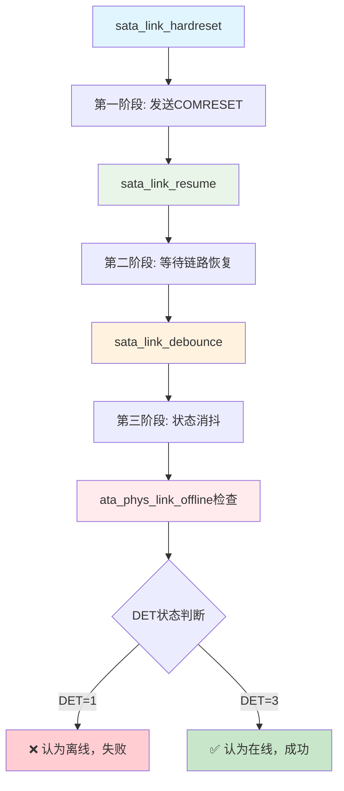

# SATA DET=1→DET=3 转换的具体代码流程

## 🎯 **核心代码路径定位**

### **主流程：从硬重置到状态检查**



## 🔬 **详细代码分析**

### **阶段1：COMRESET信号生成**
```c
// 文件: drivers/ata/libata-core.c 
// 函数: sata_link_hardreset() 第3970-3985行
int sata_link_hardreset(struct ata_link *link, const unsigned long *timing,
                       unsigned long deadline, bool *online, 
                       int (*check_ready)(struct ata_link *))
{
    u32 scontrol;
    int rc;
    
    // 🔑 关键步骤1: 生成COMRESET信号
    if ((rc = sata_scr_read(link, SCR_CONTROL, &scontrol)))
        goto out;

    // 设置DET=1 (重置PHY) - 这里生成COMRESET!
    scontrol = (scontrol & 0x0f0) | 0x301;
    
    if ((rc = sata_scr_write_flush(link, SCR_CONTROL, scontrol)))
        goto out;

    // AHCI规范要求至少等待1ms
    ata_msleep(link->ap, 1);

    // 🔑 关键步骤2: 进入链路恢复阶段
    rc = sata_link_resume(link, timing, deadline);
    if (rc)
        goto out;
        
    // 🔑 关键步骤3: 检查链路是否在线
    if (ata_phys_link_offline(link))  // ← 您的PHY在这里失败!
        goto out;
        
    // 如果到这里，说明DET=3成功
    if (online)
        *online = true;
        
    return 0;
}
```

### **阶段2：链路恢复和COMWAKE检测**
```c
// 文件: drivers/ata/libata-core.c
// 函数: sata_link_resume() 第3750-3820行
int sata_link_resume(struct ata_link *link, const unsigned long *params,
                    unsigned long deadline)
{
    int tries = ATA_LINK_RESUME_TRIES;  // 默认5次重试
    u32 scontrol, serror;
    int rc;

    do {
        // 🔑 关键步骤: 设置DET=0 (正常操作模式)
        // 这个操作会触发PHY开始COMWAKE检测!
        scontrol = (scontrol & 0x0f0) | 0x300;
        if ((rc = sata_scr_write(link, SCR_CONTROL, scontrol)))
            return rc;
            
        // 🔑 重要延迟: 等待200ms让PHY稳定
        // 这段时间内PHY应该检测到COMWAKE并转换到DET=3
        if (!(link->flags & ATA_LFLAG_NO_DB_DELAY))
            ata_msleep(link->ap, 200);

        // 验证SControl是否正确设置
        if ((rc = sata_scr_read(link, SCR_CONTROL, &scontrol)))
            return rc;
    } while ((scontrol & 0xf0f) != 0x300 && --tries);

    // 🔑 关键步骤: 状态消抖
    if ((rc = sata_link_debounce(link, params, deadline)))
        return rc;

    return 0;
}
```

### **阶段3：状态消抖和DET检测**
```c
// 文件: drivers/ata/libata-core.c  
// 函数: sata_link_debounce() 第3688-3748行
int sata_link_debounce(struct ata_link *link, const unsigned long *params,
                      unsigned long deadline)
{
    unsigned long interval = params[0];    // 默认5ms
    unsigned long duration = params[1];    // 默认100ms  
    u32 last, cur;
    int rc;

    // 🔑 读取当前DET状态
    if ((rc = sata_scr_read(link, SCR_STATUS, &cur)))
        return rc;
    cur &= 0xf;  // 提取DET字段

    last = cur;
    last_jiffies = jiffies;

    while (1) {
        ata_msleep(link->ap, interval);  // 等待5ms
        
        // 🔑 再次读取DET状态
        if ((rc = sata_scr_read(link, SCR_STATUS, &cur)))
            return rc;
        cur &= 0xf;

        // 检查DET状态是否稳定
        if (cur == last) {
            // ❌ 如果DET=1且还有时间，继续等待
            if (cur == 1 && time_before(jiffies, deadline))
                continue;
                
            // 如果状态稳定持续100ms，认为消抖完成
            if (time_after(jiffies, ata_deadline(last_jiffies, duration)))
                return 0;
            continue;
        }

        // 状态不稳定，重新开始计时
        last = cur;
        last_jiffies = jiffies;

        // 超时则降速重试
        if (time_after(jiffies, deadline))
            return -EPIPE;
    }
}
```

### **阶段4：最终状态判断**
```c
// 文件: drivers/ata/libata-core.c
// 函数: ata_phys_link_offline() 第5437-5445行
bool ata_phys_link_offline(struct ata_link *link)
{
    u32 sstatus;

    if (sata_scr_read(link, SCR_STATUS, &sstatus) == 0 &&
        !ata_sstatus_online(sstatus))  // ← 关键判断点!
        return true;
    return false;
}

// 文件: drivers/ata/libata-core.c
// 函数: ata_sstatus_online() 第179行  
static bool ata_sstatus_online(u32 sstatus)
{
    return (sstatus & 0xf) == 0x3;  // ← 您的PHY卡在这里!
}
```

## 🎯 **您的PHY具体失败位置**

### **问题定位到代码行**

```c
// 第3991行: drivers/ata/libata-core.c
if (ata_phys_link_offline(link))    // ← 这里返回true
    goto out;                       // ← 直接跳出，不尝试软重置

// 第179行: drivers/ata/libata-core.c  
static bool ata_sstatus_online(u32 sstatus)
{
    return (sstatus & 0xf) == 0x3;  // ← SStatus=1时返回false
}
```

**您的PHY报告SStatus=1，但内核要求SStatus=3才认为在线！**

## 🔧 **精确的插桩调试代码**

### **在关键位置添加调试**

```c
// 在sata_link_resume函数的第3777行后添加
static int sata_link_resume_debug(struct ata_link *link, 
                                 const unsigned long *params,
                                 unsigned long deadline)
{
    // ... 原有代码 ...
    
    // 在写入SControl=0x300后立即检查
    ata_msleep(link->ap, 200);
    
    // 🔍 插桩调试1: 检查200ms后的状态
    u32 sstatus_after_200ms;
    sata_scr_read(link, SCR_STATUS, &sstatus_after_200ms);
    printk("DEBUG: 200ms后SStatus=0x%x (DET=%d)\n", 
           sstatus_after_200ms, sstatus_after_200ms & 0xF);
    
    // 🔍 插桩调试2: 监控DET状态变化
    for (int i = 0; i < 20; i++) {
        u32 current_status;
        sata_scr_read(link, SCR_STATUS, &current_status);
        printk("DEBUG: %dms时SStatus=0x%x (DET=%d)\n", 
               i*10, current_status, current_status & 0xF);
        ata_msleep(link->ap, 10);
        
        if ((current_status & 0xF) == 0x3) {
            printk("SUCCESS: DET=3在%dms时达到!\n", i*10);
            break;
        }
    }
    
    // 继续原有的debounce流程
    if ((rc = sata_link_debounce(link, params, deadline)))
        return rc;
        
    return 0;
}
```

### **在状态检查点添加详细日志**
```c
// 修改ata_sstatus_online函数添加调试
static bool ata_sstatus_online_debug(u32 sstatus)
{
    u32 det = sstatus & 0xf;
    u32 spd = (sstatus >> 4) & 0xf;
    u32 ipm = (sstatus >> 8) & 0xf;
    
    printk("DEBUG: SStatus详细信息 - DET=%d, SPD=%d, IPM=%d\n", det, spd, ipm);
    
    if (det == 0x3) {
        printk("DEBUG: ✅ DET=3, 链路在线\n");
        return true;
    } else if (det == 0x1) {
        printk("DEBUG: ❌ DET=1, 设备存在但无通信\n");
        return false;
    } else {
        printk("DEBUG: ❌ DET=%d, 其他状态\n", det);
        return false;
    }
}
```

## 🎯 **针对性修复策略**

### **方案1：延长等待时间**
```c
// 在sata_link_resume中增加等待时间
// 第3777行附近
if (!(link->flags & ATA_LFLAG_NO_DB_DELAY))
    ata_msleep(link->ap, 1000);  // 从200ms增加到1000ms
```

### **方案2：强制重写状态检查**
```c
// 重写ata_sstatus_online函数
static bool ata_sstatus_online_1_5g_workaround(u32 sstatus)
{
    u32 det = sstatus & 0xf;
    
    // 对于1.5G PHY，DET=1也认为是在线
    if (det == 0x1 || det == 0x3) {
        printk("1.5G PHY: 认为DET=%d为在线状态\n", det);
        return true;
    }
    
    return false;
}
```

### **方案3：在hardreset中直接修复**
```c
// 在sata_link_hardreset的第3991行前添加
// if (ata_phys_link_offline(link))

// 添加1.5G PHY特殊处理
u32 sstatus;
sata_scr_read(link, SCR_STATUS, &sstatus);
if ((sstatus & 0xF) == 0x1) {
    printk("1.5G PHY: DET=1，强制认为链路在线\n");
    // 跳过offline检查，直接设置online=true
    if (online) *online = true;
    return 0;  // 成功返回
}

if (ata_phys_link_offline(link))
    goto out;
```

## 📍 **您需要修改的具体文件和行号**

1. **drivers/ata/libata-core.c:3991行** - 添加1.5G PHY特殊处理
2. **drivers/ata/libata-core.c:179行** - 修改状态判断逻辑  
3. **drivers/ata/libata-core.c:3777行** - 增加等待时间

这些就是DET=1→DET=3转换失败的精确代码位置和修复点！