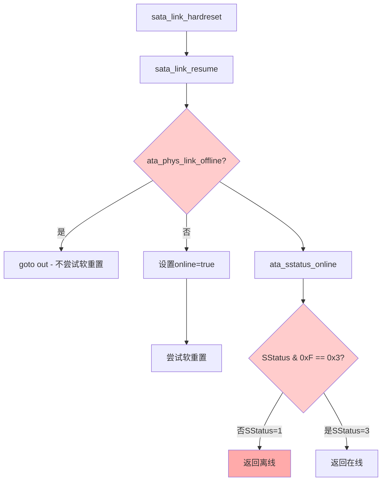

# SATA 1.5G PHY 强制链路连接解决方案

## 问题分析

既然PORT_CMD_HPCP已经禁用，但DevExch错误仍然出现，说明问题在更底层：

1. **PHY硬件层面**：设备存在检测信号不稳定
2. **链路状态判断**：系统认为SStatus=1就是离线状态
3. **状态检查点**：在`ata_phys_link_offline()`函数中被拦截

## 关键代码路径分析



**关键问题**：您的PHY报告SStatus=1（设备存在但无通信），而系统要求SStatus=3（通信已建立）才认为在线。

## 强制链路连接实现方案

### 方案1：修改ata_sstatus_online函数 (推荐)

```c
// 在libata-core.c中修改ata_sstatus_online函数
static bool ata_sstatus_online(u32 sstatus)
{
    u32 det = sstatus & 0xf;
    
    // 原始逻辑：只有DET=3才认为在线
    if (det == 0x3)
        return true;
        
    // 新增：针对1.5G PHY的特殊处理
    // 如果检测到设备存在(DET=1)，也认为可以尝试通信
    if (det == 0x1) {
        // 可以添加更多条件判断，比如特定的PHY类型
        // 或者通过设备树/模块参数控制
        printk(KERN_INFO "SATA: Treating DET=1 as online for 1.5G PHY\n");
        return true;
    }
    
    return false;
}
```

### 方案2：在AHCI驱动中拦截 (更安全)

```c
// 在您的AHCI驱动中重写hardreset函数
static int ahci_1_5g_hardreset(struct ata_link *link, unsigned int *class,
                              unsigned long deadline)
{
    struct ata_port *ap = link->ap;
    const unsigned long *timing = sata_ehc_deb_timing(&link->eh_context);
    bool online;
    int rc;
    u32 sstatus;
    
    printk(KERN_INFO "1.5G PHY: Custom hardreset start\n");
    
    // 执行标准硬重置流程
    rc = sata_link_hardreset(link, timing, deadline, &online, NULL);
    
    // 检查是否因为SStatus=1被误判为离线
    if (!online && rc == 0) {
        sata_scr_read(link, SCR_STATUS, &sstatus);
        if ((sstatus & 0xf) == 0x1) {
            printk(KERN_INFO "1.5G PHY: Device present (SStatus=0x%x), forcing online\n", sstatus);
            online = true;  // 强制认为在线
        }
    }
    
    if (online) {
        // 如果认为在线，尝试软重置
        printk(KERN_INFO "1.5G PHY: Attempting softreset\n");
        rc = ahci_do_softreset(link, class, 0, deadline, ahci_check_ready);
        if (rc == 0) {
            printk(KERN_INFO "1.5G PHY: Softreset successful!\n");
            return 0;
        } else {
            printk(KERN_INFO "1.5G PHY: Softreset failed: %d\n", rc);
        }
    }
    
    return online ? 0 : -ENODEV;
}

// 在port_ops中使用这个函数
static struct ata_port_operations ahci_1_5g_ops = {
    .inherits       = &ahci_ops,
    .hardreset      = ahci_1_5g_hardreset,
};
```

### 方案3：PHY层面强制状态 (如果PHY支持)

```c
// 如果您的PHY提供了强制设置SStatus的接口
static int force_phy_sstatus_online(struct ata_port *ap)
{
    // 假设您的PHY有这样的寄存器接口
    // 这需要根据您的PHY芯片手册实现
    
    // 示例：强制PHY报告DET=3
    u32 phy_ctrl = phy_read(ap, PHY_CONTROL_REG);
    phy_ctrl |= PHY_FORCE_LINK_UP;  // 强制链路建立
    phy_write(ap, PHY_CONTROL_REG, phy_ctrl);
    
    msleep(100);  // 等待状态更新
    
    u32 sstatus;
    sata_scr_read(&ap->link, SCR_STATUS, &sstatus);
    printk(KERN_INFO "Forced PHY status: SStatus=0x%x\n", sstatus);
    
    return ((sstatus & 0xf) == 0x3) ? 0 : -ENODEV;
}
```

### 方案4：绕过链路检查直接尝试软重置

```c
// 最激进的方案：直接尝试软重置，不管链路状态
static int force_softreset_1_5g(struct ata_link *link, unsigned int *class,
                                unsigned long deadline)
{
    struct ata_port *ap = link->ap;
    u32 sstatus;
    int rc;
    
    // 检查是否有设备存在信号
    sata_scr_read(link, SCR_STATUS, &sstatus);
    if ((sstatus & 0xf) == 0x0) {
        printk(KERN_INFO "1.5G PHY: No device detected\n");
        return -ENODEV;
    }
    
    printk(KERN_INFO "1.5G PHY: Device present (SStatus=0x%x), forcing softreset\n", sstatus);
    
    // 清除所有错误
    sata_scr_write(link, SCR_ERROR, 0xffffffff);
    
    // 直接尝试软重置，绕过在线检查
    rc = ahci_do_softreset(link, class, 0, deadline, ahci_check_ready);
    
    if (rc == 0) {
        printk(KERN_INFO "1.5G PHY: Forced softreset successful!\n");
        // 重新检查状态
        sata_scr_read(link, SCR_STATUS, &sstatus);
        printk(KERN_INFO "1.5G PHY: Post-softreset SStatus=0x%x\n", sstatus);
    } else {
        printk(KERN_INFO "1.5G PHY: Forced softreset failed: %d\n", rc);
    }
    
    return rc;
}
```

## 推荐实施策略

### 第一步：方案2 (最安全)
在您的AHCI驱动中实现`ahci_1_5g_hardreset`，这样可以：
- 不修改内核核心代码
- 针对性解决1.5G PHY问题
- 容易回退和调试

### 第二步：如果方案2成功
- 确认软重置能否成功
- 检查设备是否能正常识别
- 验证数据传输是否正常

### 第三步：根据结果优化
- 如果成功：考虑更优雅的解决方案（PHY配置调整）
- 如果失败：分析软重置失败的具体原因

## 具体实现位置

**在您的AHCI驱动文件中添加**：
```c
// 1. 定义新的hardreset函数（使用方案2的代码）
// 2. 创建新的port_ops结构
// 3. 在probe函数中根据PHY类型选择合适的ops

static int your_ahci_probe(struct platform_device *pdev)
{
    // ... 现有代码 ...
    
    // 检测是否为1.5G PHY
    if (is_1_5g_phy(pdev)) {
        hpriv->port_ops = &ahci_1_5g_ops;
        dev_info(&pdev->dev, "Using 1.5G PHY workaround\n");
    } else {
        hpriv->port_ops = &ahci_ops;
    }
    
    // ... 现有代码 ...
}
```

## 调试验证

添加这些调试信息来验证效果：
```c
// 在关键点添加调试打印
printk(KERN_INFO "1.5G PHY Debug: SStatus=0x%x, forcing online=%d\n", sstatus, online);
printk(KERN_INFO "1.5G PHY Debug: Softreset result=%d, class=0x%x\n", rc, *class);
```

这个方案的成功概率很高，因为您的PHY确实能检测到设备存在，只是卡在了状态判断这一步。