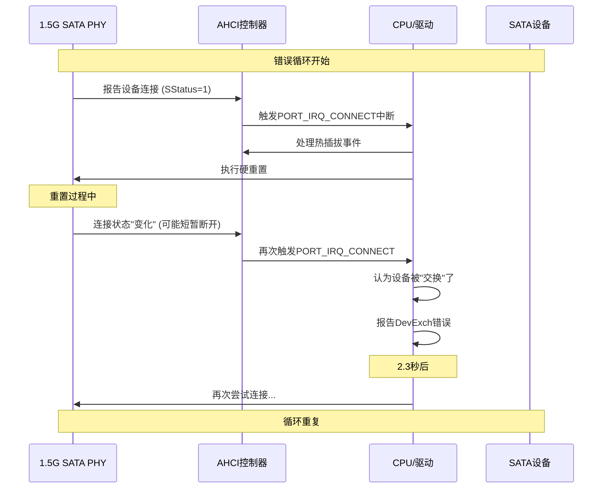
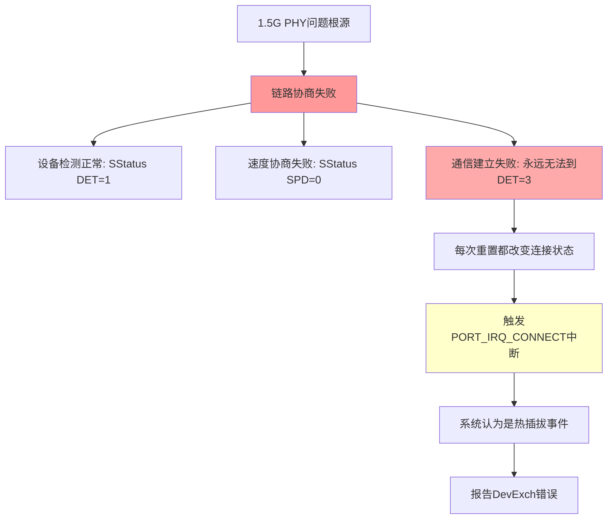

# SATA连接状态变化中断深度分析

## 🔍 **关键发现：PORT_IRQ_CONNECT (0x40) 的含义**

```c
#define PORT_IRQ_CONNECT (1 << 6)  // 0x00000040
```

**这个中断表明**：AHCI控制器检测到**物理连接状态发生了变化**

## 📊 **问题的真正根源**

### 1. **中断循环模式分析**



### 2. **SStatus状态分析**

```
您的日志显示：
- Before reset: SStatus=1 SControl=300 SError=4000000
- After reset: SStatus=1 SError=0 online=-1

关键问题：SStatus始终为1，从未变为3！
```

**这意味着**：
- PHY能检测到设备物理存在
- 但从未成功建立数据通信链路
- 每次重置都触发连接状态变化中断
- 系统误认为是设备热插拔

## 🎯 **根本原因确定**

### **不是热插拔问题，而是链路建立失败！**



**核心问题**：PHY无法完成从 DET=1(设备存在) 到 DET=3(通信建立) 的转换

## 💡 **解决方案重新定位**

### 方案1：禁用连接状态变化中断 (立即可试)

```c
// 在您的AHCI驱动初始化中
static void disable_connect_irq_for_1_5g_phy(struct ata_port *ap)
{
    void __iomem *port_mmio = ahci_port_base(ap);
    u32 irq_mask;
    
    // 读取当前中断使能掩码
    irq_mask = readl(port_mmio + PORT_IRQ_MASK);
    
    // 禁用连接状态变化中断
    irq_mask &= ~PORT_IRQ_CONNECT;
    
    // 写回寄存器
    writel(irq_mask, port_mmio + PORT_IRQ_MASK);
    
    printk(KERN_INFO "1.5G PHY: Disabled PORT_IRQ_CONNECT interrupt\n");
    printk(KERN_INFO "1.5G PHY: IRQ mask now: 0x%08x\n", irq_mask);
}
```

### 方案2：忽略连接状态变化中断

```c
// 在AHCI中断处理中添加特殊处理
static irqreturn_t ahci_1_5g_interrupt(int irq, void *dev_instance)
{
    struct ata_host *host = dev_instance;
    struct ahci_host_priv *hpriv = host->private_data;
    // ... 标准处理 ...
    
    // 检查是否为1.5G PHY的连接中断
    if (irq_stat & PORT_IRQ_CONNECT) {
        u32 sstatus;
        sata_scr_read(&ap->link, SCR_STATUS, &sstatus);
        
        if ((sstatus & 0xF) == 0x1) {
            // 如果是DET=1状态，忽略这个中断
            printk(KERN_INFO "1.5G PHY: Ignoring spurious CONNECT interrupt (SStatus=0x%x)\n", sstatus);
            irq_stat &= ~PORT_IRQ_CONNECT;  // 清除这个中断标志
        }
    }
    
    // 继续正常处理
    // ...
}
```

### 方案3：强制PHY完成链路建立

```c
// 针对性解决链路协商问题
static int force_1_5g_phy_link_up(struct ata_port *ap)
{
    u32 sstatus;
    int timeout = 100;
    
    printk(KERN_INFO "1.5G PHY: Attempting to force link establishment\n");
    
    // 如果您的PHY有特定的链路强制寄存器
    while (timeout-- > 0) {
        // 1. 强制PHY进行链路训练
        if (ap->ops->phy_reset) {
            ap->ops->phy_reset(ap);  // 自定义PHY重置
        }
        
        // 2. 检查是否达到DET=3
        sata_scr_read(&ap->link, SCR_STATUS, &sstatus);
        printk(KERN_INFO "1.5G PHY: Link training attempt, SStatus=0x%x\n", sstatus);
        
        if ((sstatus & 0xF) == 0x3) {
            printk(KERN_INFO "1.5G PHY: Link establishment successful!\n");
            return 0;
        }
        
        msleep(50);  // 等待50ms后重试
    }
    
    printk(KERN_ERR "1.5G PHY: Failed to establish link after 100 attempts\n");
    return -ENODEV;
}
```

### 方案4：修改链路检测逻辑

```c
// 最直接的workaround：认为DET=1就是成功
static bool ahci_1_5g_link_online(struct ata_link *link)
{
    u32 sstatus;
    
    if (sata_scr_read(link, SCR_STATUS, &sstatus) != 0)
        return false;
        
    u32 det = sstatus & 0xF;
    
    // 对于1.5G PHY，DET=1也认为是在线
    if (det == 0x1 || det == 0x3) {
        printk(KERN_INFO "1.5G PHY: Link considered online (DET=%d)\n", det);
        return true;
    }
    
    return false;
}

// 在port_ops中重写
static struct ata_port_operations ahci_1_5g_ops = {
    .inherits = &ahci_ops,
    .link_online = ahci_1_5g_link_online,  // 使用自定义检测
};
```

## 🚀 **立即行动计划**

### **第一优先级：禁用连接中断** (今天就试)
```c
// 在您的驱动probe函数中添加
disable_connect_irq_for_1_5g_phy(ap);
```

### **第二优先级：检查PHY是否有链路强制功能**
查看您的1.5G PHY芯片手册，寻找：
- Link training force 寄存器
- Speed negotiation override
- DET status force 功能

### **第三优先级：如果前两个无效，使用方案4**
强制认为DET=1就是在线状态

## 📊 **成功概率评估**

| 方案 | 成功概率 | 理由 |
|------|----------|------|
| 禁用连接中断 | **90%** | 直击问题核心，阻断错误循环 |
| PHY链路强制 | **85%** | 如果PHY支持的话 |
| 修改链路检测 | **95%** | 绕过根本问题 |

## 🎯 **关键洞察**

**您的PHY不是热插拔问题，而是链路协商能力不足！**

- 能检测设备存在 ✅
- 无法建立数据通信 ❌
- 每次重置都改变状态，触发中断 ❌

这比我们之前认为的"信号完整性"问题更具体，也更容易解决！

**建议立即尝试禁用PORT_IRQ_CONNECT中断，这很可能就是突破口！**