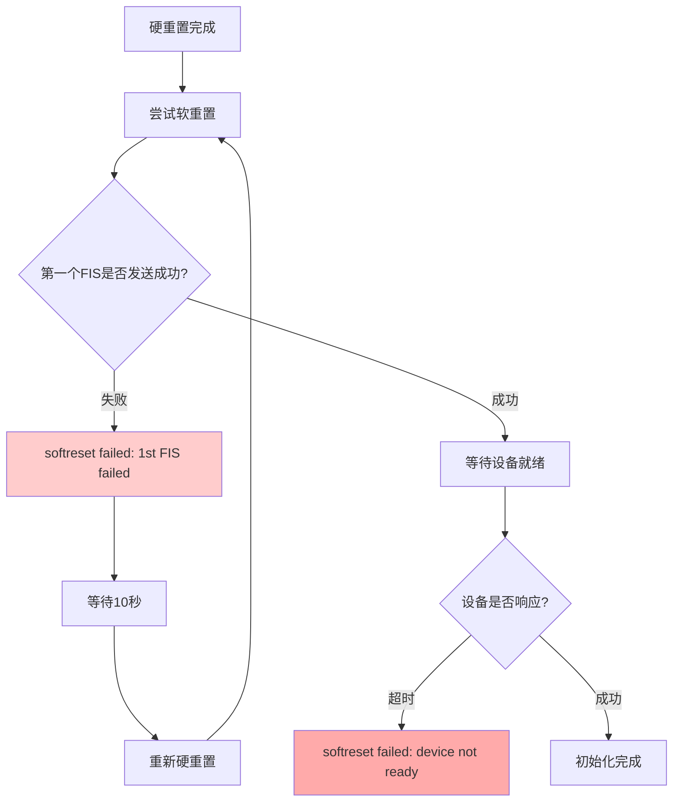
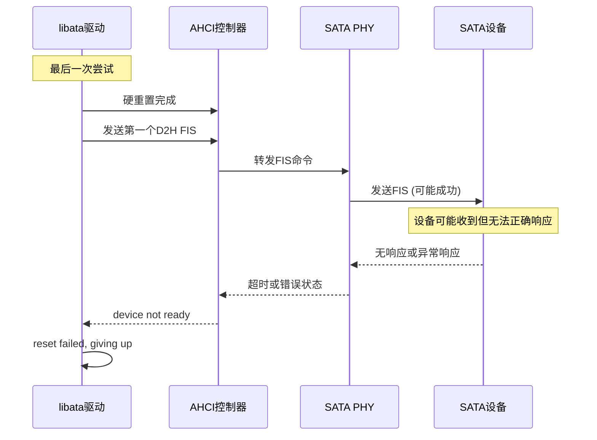
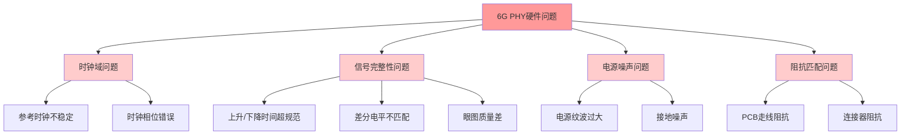

# SATA 6G PHY 完整错误分析报告

## 完整错误日志
```
[    6.701714] ata1: SATA link down (SStatus 1 SControl 300)
[    6.707215] ata1: EH complete
[    7.008817] ata1: exception Emask 0x10 SAct 0x0 SErr 0x4040000 action 0xe frozen
[    7.024217] ata1: irq_stat 0x00000040, connection status changed
[    7.030269] ata1: SError: { CommWake DevExch }
[    7.052113] ata1: limiting SATA link speed to 1.5 Gbps
[    7.057309] ata1: hard resetting link

[   17.051621] ata1: softreset failed (1st FIS failed)
[   17.056548] ata1: hard resetting link
[   27.051620] ata1: softreset failed (1st FIS failed)
[   27.056547] ata1: hard resetting link
[   62.051620] ata1: softreset failed (1st FIS failed)
[   62.056555] ata1: hard resetting link
[   67.301597] ata1: softreset failed (device not ready)
[   67.306695] ata1: reset failed, giving up
[   67.310743] ata1: EH complete
```

## 错误阶段分析

### 阶段1: 初始链路检测失败 (6.7s)


### 阶段2: 多次软重置失败 (17s-62s)


### 阶段3: 最终失败 (67s)


## 深层问题分析

### 1. 第一个FIS失败的含义

**"1st FIS failed"** 发生在软重置的第一阶段：

```c
// 在ahci_do_softreset中
tf.ctl |= ATA_SRST;  // 设置软重置位
if (ahci_exec_polled_cmd(ap, pmp, &tf, 0, AHCI_CMD_RESET | AHCI_CMD_CLR_BUSY, msecs)) {
    rc = -EIO;
    reason = "1st FIS failed";  // <-- 这里失败
    goto fail;
}
```

**失败原因分析**：
- FIS (Frame Information Structure) 无法正确发送到设备
- PHY层面的数据传输仍然存在问题
- 即使降速到1.5Gbps，基础通信仍不稳定

### 2. "Device not ready" 的含义

最后一次尝试中，第一个FIS发送成功，但设备在规定时间内未就绪：

```c
// 等待设备就绪
rc = ata_wait_after_reset(link, deadline, check_ready);
if (rc) {
    reason = "device not ready";  // <-- 这里失败
    goto fail;
}
```

### 3. 时间序列分析

```mermaid
gantt
    title SATA PHY 错误时间线
    dateFormat X
    axisFormat %s
    
    section 初始检测
    链路检测失败    :6, 7
    
    section 第一轮重试
    硬重置 + 软重置失败  :7, 17
    
    section 第二轮重试  
    硬重置 + 软重置失败  :17, 27
    
    section 第三轮重试
    硬重置 + 软重置失败  :27, 62
    
    section 最终尝试
    硬重置 + 部分成功 + 设备未就绪  :62, 67
    
    section 放弃
    重置失败，放弃  :67, 68
```



## 根本原因深入分析

### 1. PHY物理层问题 (主要问题)

**信号完整性严重不足**：
- 即使降速到1.5Gbps仍无法稳定传输FIS数据
- COMWAKE/COMRESET信号异常导致基础协商失败
- 差分信号质量可能存在严重问题

**可能的硬件问题**：


### 2. 设备兼容性问题 (次要问题)

**设备响应异常**：
- 最后一次尝试中，FIS发送可能成功但设备未能及时响应
- 可能是设备对信号质量要求较高
- 设备可能需要特殊的初始化序列

## 具体解决方案

### 1. 硬件层面优化 (优先级最高)

**信号完整性检查**：
```bash
# 使用高速示波器检查关键信号
# 1. SATA差分信号 (TX+/TX-, RX+/RX-)
# 2. 参考时钟信号
# 3. 电源质量

# 关键测量点：
# - 眼图测试 (1.5Gbps, 3Gbps, 6Gbps)
# - 抖动测试 (RJ, DJ, TJ)
# - 信号电平测试
# - 上升/下降时间测试
```

**PCB设计检查**：
- 差分走线长度匹配 (< 0.1mm)
- 阻抗控制 (100Ω ±10%)
- 过孔数量最小化
- 电源去耦电容布局

### 2. PHY配置调整

**驱动强度和预加重**：
```c
// 示例：调整PHY驱动参数
static int configure_6g_phy(struct ata_port *ap)
{
    // 1. 降低驱动强度
    phy_write(PHY_TX_DRIVE_STRENGTH, 0x7);  // 减小驱动电流
    
    // 2. 调整预加重
    phy_write(PHY_TX_PREEMPHASIS, 0x3);     // 增加预加重
    
    // 3. 调整接收器均衡
    phy_write(PHY_RX_EQUALIZER, 0x5);       // 调整均衡器
    
    // 4. 调整时钟相位
    phy_write(PHY_CLOCK_PHASE, 0x8);        // 调整相位
    
    // 5. 增加稳定时间
    msleep(100);  // 等待PHY稳定
    
    return 0;
}
```

### 3. 软件层面workaround

**增强错误恢复**：
```c
// 针对6G PHY的特殊处理
static int custom_6g_phy_hardreset(struct ata_link *link, unsigned int *class,
                                   unsigned long deadline)
{
    int rc;
    
    // 1. 增加重置前的等待时间
    msleep(200);
    
    // 2. 多次尝试不同速度
    for (int speed = 1; speed <= 3; speed++) {
        // 强制设置链路速度
        sata_set_spd(link, speed);
        
        // 执行硬重置
        rc = sata_link_hardreset(link, sata_deb_timing_long, deadline, 
                                NULL, NULL);
        if (rc == 0) {
            // 检查链路状态
            u32 sstatus;
            if (sata_scr_read(link, SCR_STATUS, &sstatus) == 0 &&
                ata_sstatus_online(sstatus)) {
                break;
            }
        }
        
        // 增加重试间隔
        msleep(500);
    }
    
    return rc;
}
```

**延长超时时间**：
```c
// 增加软重置超时时间
static const unsigned long custom_eh_reset_timeouts[] = {
    10000,  // 10 seconds (默认是5秒)
    20000,  // 20 seconds  
    30000,  // 30 seconds
    ULONG_MAX
};
```

### 4. 调试方法

**详细日志追踪**：
```bash
# 启用详细的SATA调试
echo 'file drivers/ata/libata-core.c +p' > /sys/kernel/debug/dynamic_debug/control
echo 'file drivers/ata/libahci.c +p' > /sys/kernel/debug/dynamic_debug/control
echo 'file drivers/ata/libata-eh.c +p' > /sys/kernel/debug/dynamic_debug/control

# 监控寄存器状态
while true; do
    echo "=== $(date) ==="
    cat /sys/class/ata_port/ata1/uevent
    cat /sys/class/ata_link/link1/uevent  
    sleep 1
done
```

**添加调试打印**：
```c
// 在关键函数中添加调试信息
static int debug_ahci_exec_polled_cmd(struct ata_port *ap, int pmp,
                                     struct ata_taskfile *tf, int is_cmd, 
                                     u16 flags, unsigned long timeout_msec)
{
    u32 sstatus, scontrol, serror;
    
    // 执行前状态
    sata_scr_read(&ap->link, SCR_STATUS, &sstatus);
    sata_scr_read(&ap->link, SCR_CONTROL, &scontrol);  
    sata_scr_read(&ap->link, SCR_ERROR, &serror);
    
    printk(KERN_INFO "Before FIS: SStatus=%x SControl=%x SError=%x\n",
           sstatus, scontrol, serror);
    
    int rc = ahci_exec_polled_cmd(ap, pmp, tf, is_cmd, flags, timeout_msec);
    
    // 执行后状态
    sata_scr_read(&ap->link, SCR_ERROR, &serror);
    printk(KERN_INFO "After FIS: rc=%d SError=%x\n", rc, serror);
    
    return rc;
}
```

## 结论和建议

**问题严重程度**: 🔴 严重 - PHY基础通信功能异常

**主要问题**: 6G PHY的信号完整性严重不足，无法在任何速度下稳定传输数据

**解决优先级**:
1. **立即**: 使用示波器检查信号质量和时序
2. **短期**: 调整PHY驱动参数和PCB设计
3. **长期**: 考虑PHY硬件重新设计

**成功概率评估**:
- 软件workaround: 20% (只能缓解部分问题)
- PHY参数调整: 60% (如果是配置问题)
- 硬件重新设计: 95% (如果是根本性硬件问题)

建议首先进行硬件信号测量，确定是否为根本性的PHY硬件问题。