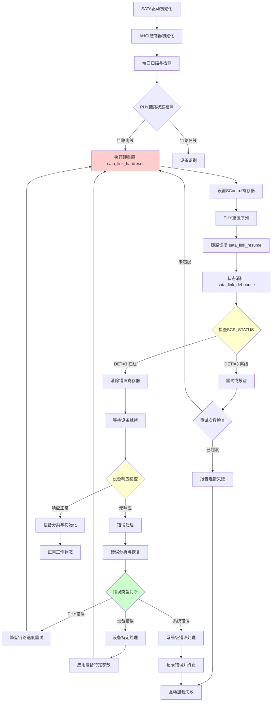
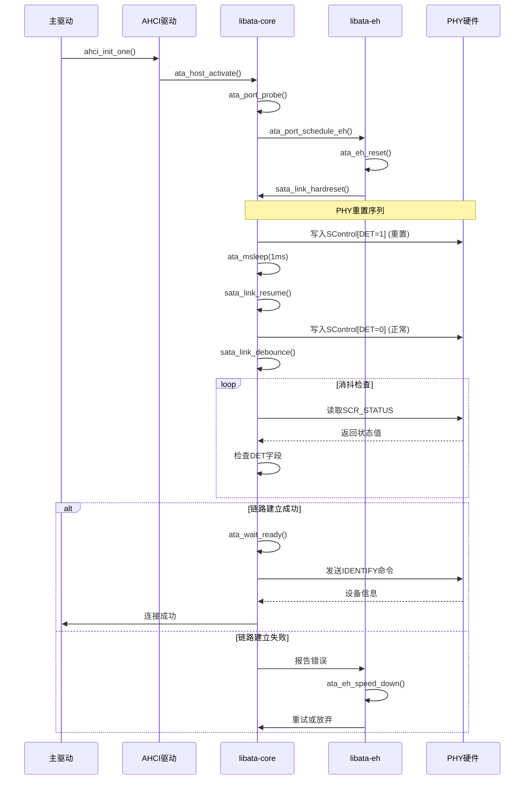
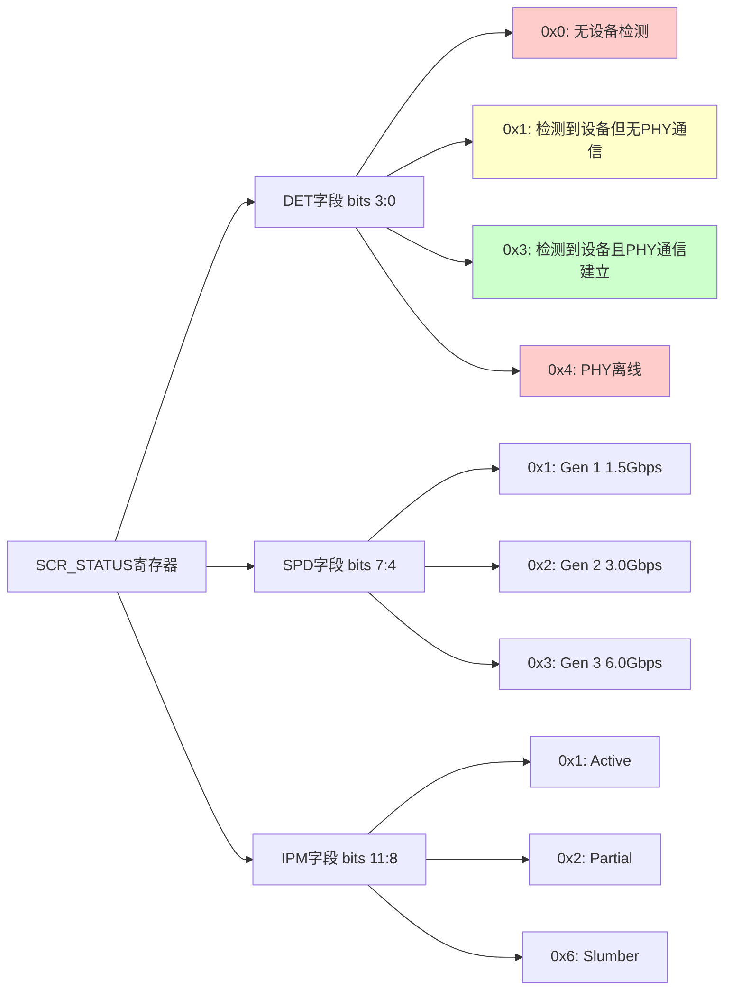

# SATA PHY 驱动分析流程图

## 概述
本文档分析Linux内核中SATA PHY驱动的工作流程，特别关注新SATA PHY连接SATA设备时的问题排查路径。

## SATA PHY 驱动核心流程图



## 关键函数调用链



## SATA PHY状态寄存器分析



## 问题排查检查点

### 1. PHY硬件层面检查
- **时钟源**: 确认SATA PHY的参考时钟正确
- **电源域**: 检查SATA PHY的电源域是否正常上电
- **复位信号**: 确认PHY复位信号时序正确

### 2. 寄存器配置检查
- **SControl寄存器**: 检查DET、SPD、IPM字段配置
- **SStatus寄存器**: 监控链路状态变化
- **SError寄存器**: 查看PHY层错误

### 3. 驱动层面检查
- **初始化顺序**: 确认AHCI控制器和PHY初始化顺序
- **时序参数**: 检查复位和消抖时序参数
- **兼容性**: 验证PHY驱动与libata的兼容性

### 4. 调试方法
```bash
# 查看SATA端口状态
cat /sys/class/ata_port/ata*/uevent

# 查看链路错误
cat /sys/class/ata_link/link*/uevent

# 使用ftrace跟踪SATA事件
echo 1 > /sys/kernel/debug/tracing/events/libata/enable
```

## 常见问题及解决方案

1. **PHY初始化失败**
   - 检查PHY时钟和电源
   - 验证PHY配置参数
   - 确认与AHCI控制器接口

2. **链路建立失败**
   - 调整链路速度设置
   - 检查信号完整性
   - 验证电缆和连接器

3. **设备识别失败**
   - 检查设备兼容性
   - 调整电源管理设置
   - 验证命令超时参数