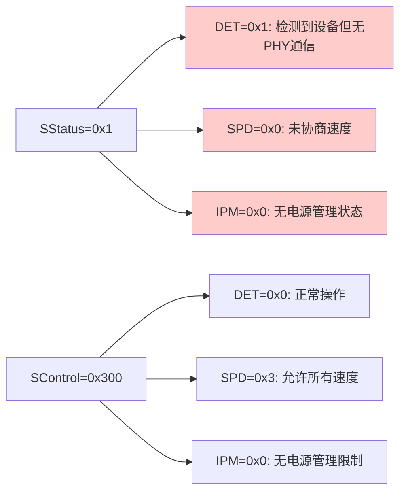
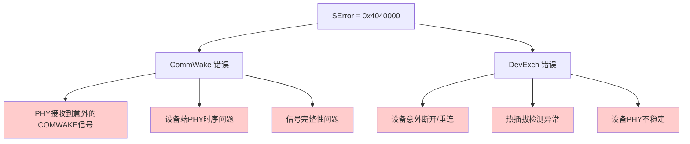
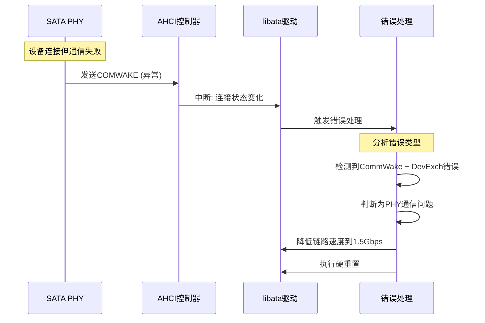

# SATA PHY 错误分析报告

## 错误日志解析

### 原始日志
```
[    6.701714] ata1: SATA link down (SStatus 1 SControl 300)
[    6.707215] ata1: EH complete
[    7.008817] ata1: exception Emask 0x10 SAct 0x0 SErr 0x4040000 action 0xe frozen
[    7.024217] ata1: irq_stat 0x00000040, connection status changed
[    7.030269] ata1: SError: { CommWake DevExch }
[    7.052113] ata1: limiting SATA link speed to 1.5 Gbps
[    7.057309] ata1: hard resetting link
```

## 详细错误分析

### 1. 链路状态分析

**SStatus = 0x1, SControl = 0x300**



**关键问题**: PHY检测到设备存在，但无法建立通信链路

### 2. 错误寄存器分析

**SErr = 0x4040000**

- **CommWake (bit 18)**: 0x40000 = 通信唤醒信号错误
- **DevExch (bit 26)**: 0x4000000 = 设备交换错误



### 3. 中断状态分析

**irq_stat = 0x40 (connection status changed)**

- AHCI中断状态寄存器的第6位(0x40)表示连接状态改变
- 表明AHCI控制器检测到PHY连接状态发生变化

### 4. 错误处理流程



## 根本原因分析

### 可能的硬件问题

1. **PHY时序问题**
   - 您的新SATA PHY发送COMWAKE信号的时序可能不符合标准
   - 与AHCI控制器的时序匹配存在问题

2. **信号完整性问题** 
   - 差分信号的上升/下降时间不匹配
   - 信号电平不在规范范围内
   - 传输线阻抗不匹配

3. **时钟域问题**
   - PHY参考时钟与AHCI控制器时钟域切换问题
   - 时钟抖动过大影响通信

### 可能的驱动问题

1. **PHY初始化不完整**
   - PHY特定的配置参数缺失
   - 初始化序列与标准AHCI不兼容

2. **错误恢复机制**
   - PHY的错误恢复能力不足
   - 与libata的错误处理流程不匹配

## 解决方案建议

### 1. 硬件层面排查

```bash
# 检查PHY寄存器状态
devmem 0x[PHY_BASE_ADDR] 32  # 根据您的PHY基地址

# 监控COMWAKE信号
# 使用示波器或逻辑分析仪检查:
# - COMWAKE脉冲宽度 (应为106.7ns)
# - COMRESET脉冲宽度 (应为320ns)
# - 差分信号质量
```

### 2. 驱动层面调试

```c
// 在sata_link_hardreset函数中添加调试
static int debug_sata_link_hardreset(struct ata_link *link, 
                                    const unsigned long *timing,
                                    unsigned long deadline,
                                    bool *online, 
                                    int (*check_ready)(struct ata_link *))
{
    u32 scontrol, sstatus, serror;
    int rc;
    
    // 重置前状态
    sata_scr_read(link, SCR_STATUS, &sstatus);
    sata_scr_read(link, SCR_CONTROL, &scontrol);
    sata_scr_read(link, SCR_ERROR, &serror);
    
    printk(KERN_INFO "Before reset: SStatus=%x SControl=%x SError=%x\n", 
           sstatus, scontrol, serror);
    
    // 执行标准重置
    rc = sata_link_hardreset(link, timing, deadline, online, check_ready);
    
    // 重置后状态
    sata_scr_read(link, SCR_STATUS, &sstatus);
    sata_scr_read(link, SCR_ERROR, &serror);
    
    printk(KERN_INFO "After reset: SStatus=%x SError=%x online=%d\n", 
           sstatus, serror, online ? *online : -1);
    
    return rc;
}
```

### 3. PHY配置优化

```c
// 针对您的PHY添加特定配置
static int custom_phy_init(struct ata_port *ap)
{
    // 1. 调整PHY时序参数
    // 2. 设置合适的驱动强度
    // 3. 配置均衡器参数
    // 4. 调整时钟相位
    
    return 0;
}
```

### 4. 错误恢复增强

```c
// 在AHCI驱动中添加CommWake错误的特殊处理
static void handle_commwake_error(struct ata_port *ap)
{
    // 1. 增加PHY重置前的等待时间
    // 2. 调整链路速度协商策略
    // 3. 实现设备特定的恢复序列
}
```

## 下一步调试建议

1. **使用ftrace跟踪完整的重置流程**
```bash
echo 1 > /sys/kernel/debug/tracing/events/libata/enable
echo 1 > /sys/kernel/debug/tracing/events/libata/ata_eh_link_autopsy/enable
```

2. **监控SCR寄存器变化**
3. **检查PHY硬件手册中的时序规范**
4. **对比工作正常的SATA PHY的波形**

这个错误表明您的新SATA PHY在物理层通信协商阶段存在问题，需要重点关注PHY的时序配置和信号完整性。