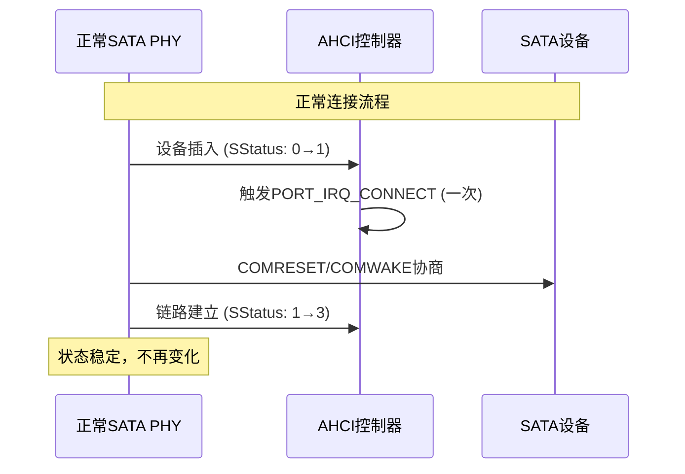
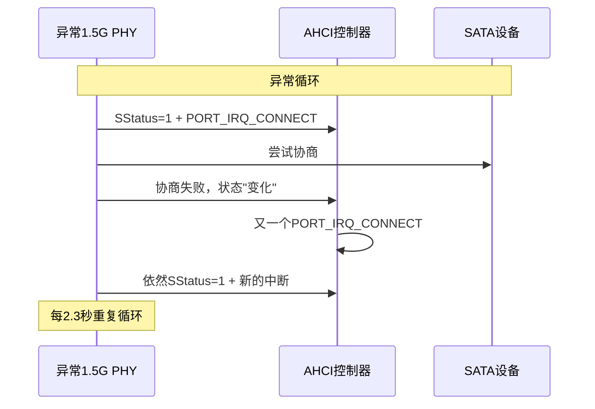
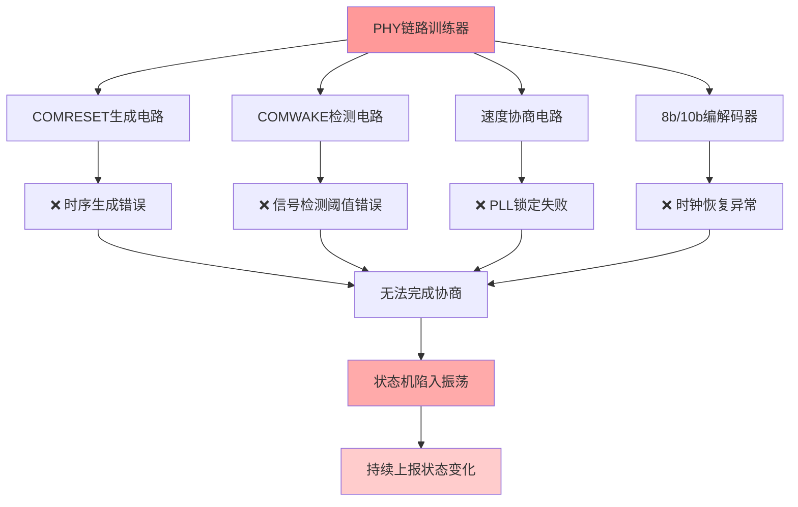

# SATA PHY 持续状态变化的硬件根因分析

## 🚨 **您的洞察完全正确！**

PHY一直上报`PORT_IRQ_CONNECT`状态变化本身就是**根本性的硬件问题**，不是正常现象。

## 📊 **正常vs异常行为对比**

### ✅ **正常SATA PHY行为**


### ❌ **您的1.5G PHY异常行为**


## 🔍 **PHY硬件问题的可能原因**

### 1. **链路训练电路异常**


### 2. **具体的硬件缺陷类型**

#### **时钟域问题**
```c
可能的问题：
- PHY内部PLL无法稳定锁定到1.5GHz
- 参考时钟抖动过大
- 时钟相位关系错误
- 时钟gating逻辑有bug

表现：链路训练开始但无法完成，状态在尝试建立时反复变化
```

#### **模拟前端问题**
```c
可能的问题：
- 差分接收器阈值设置错误
- 发送器驱动强度不匹配
- 共模电压范围问题
- 信号完整性在某些条件下不稳定

表现：物理检测OK，但数字信号解析失败
```

#### **状态机设计缺陷**
```c
可能的问题：
- 链路训练状态机有死循环
- 错误恢复逻辑有bug
- 超时设置不合理
- 状态转换条件有逻辑错误

表现：PHY认为一直在"尝试"建立连接
```

## 🎯 **真正的解决方向**

### ❌ **软件workaround的局限性**
```
禁用PORT_IRQ_CONNECT中断：
✓ 能停止错误循环
✓ 能避免DevExch错误
❌ 不能解决PHY根本无法建立链路的问题
❌ 即使进入软重置，FIS传输依然会失败
```

### ✅ **需要从硬件层面解决**

#### **1. PHY内部寄存器诊断**
```c
// 需要检查的PHY内部状态
- Link training state machine状态
- PLL lock状态  
- Clock recovery状态
- Error counter寄存器
- Debug/test模式寄存器

// 示例代码（需要根据您的PHY芯片调整）
u32 phy_state = phy_read(PHY_LINK_STATE_REG);
u32 pll_status = phy_read(PHY_PLL_STATUS_REG);  
u32 error_count = phy_read(PHY_ERROR_COUNTER_REG);

printk("PHY State: 0x%x, PLL: 0x%x, Errors: %d\n", 
       phy_state, pll_status, error_count);
```

#### **2. 时钟和电源质量检查**
```bash
# 硬件测量清单
1. 参考时钟质量 (150MHz典型)
   - 频率准确度: ±100ppm
   - 抖动: <1ps RMS
   - 占空比: 45%-55%

2. 电源质量
   - 1.8V/3.3V纹波 <50mV
   - 上电时序正确
   - 去耦电容ESR <10mΩ

3. 差分信号质量  
   - 眼图在1.5Gbps下是否达标
   - 共模电压是否在规范内
   - 是否有串扰或反射
```

#### **3. PHY配置参数调整**
```c
// 可能需要调整的PHY参数
static int configure_phy_for_stable_operation(void)
{
    // 1. 降低链路训练的激进程度
    phy_write(PHY_LINK_TRAINING_CTRL, 0x1);  // 保守模式
    
    // 2. 增加超时时间
    phy_write(PHY_TIMEOUT_CONFIG, 0x1000);   // 更长超时
    
    // 3. 调整信号电平
    phy_write(PHY_TX_AMPLITUDE, 0x8);        // 中等驱动强度
    phy_write(PHY_RX_THRESHOLD, 0x4);        // 中等接收阈值
    
    // 4. 强制使用最保守的设置
    phy_write(PHY_SPEED_CONFIG, 0x1);        // 仅1.5Gbps
    phy_write(PHY_POWER_CONFIG, 0x0);        // 禁用电源管理
    
    return 0;
}
```

## 💡 **诊断策略**

### **第一步：确认是否为根本性硬件缺陷**
```c
// 在最简单的条件下测试PHY
static int minimal_phy_test(void)
{
    // 1. 禁用所有高级功能
    // 2. 使用最保守的参数
    // 3. 监控是否还会有状态变化
    
    int i;
    u32 sstatus_prev, sstatus_curr;
    
    sata_scr_read(link, SCR_STATUS, &sstatus_prev);
    
    for (i = 0; i < 100; i++) {
        msleep(100);
        sata_scr_read(link, SCR_STATUS, &sstatus_curr);
        
        if (sstatus_curr != sstatus_prev) {
            printk("PHY unstable: SStatus changed from 0x%x to 0x%x at %dms\n",
                   sstatus_prev, sstatus_curr, i*100);
            return -1;  // PHY硬件有问题
        }
    }
    
    printk("PHY stable for 10 seconds\n");
    return 0;  // PHY基本稳定
}
```

### **第二步：如果PHY能稳定，再尝试软件方案**
只有确认PHY不会持续变化状态后，软件workaround才有意义。

## 🎯 **结论**

**您的判断完全正确**：PHY持续上报状态变化是根本性硬件问题，可能的原因：

1. **PHY设计缺陷** - 链路训练逻辑有bug
2. **时钟/电源问题** - 影响PHY稳定性  
3. **模拟电路参数** - 需要重新校准
4. **PCB设计问题** - 信号完整性不足

**建议优先级**：
1. **硬件诊断** - 检查PHY内部状态和时钟电源
2. **PHY参数调整** - 尝试更保守的配置
3. **如果硬件确实稳定** - 再考虑软件workaround

软件方案只能作为临时措施，根本解决需要修复PHY硬件层面的问题。