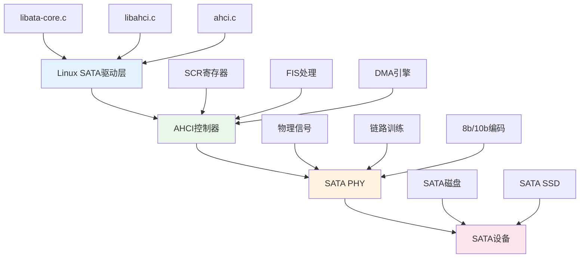
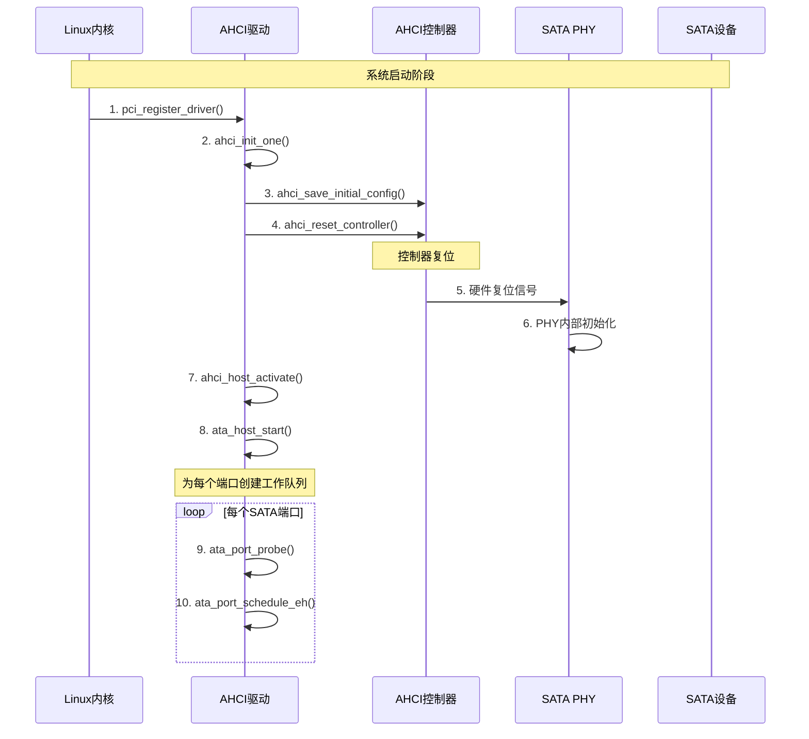
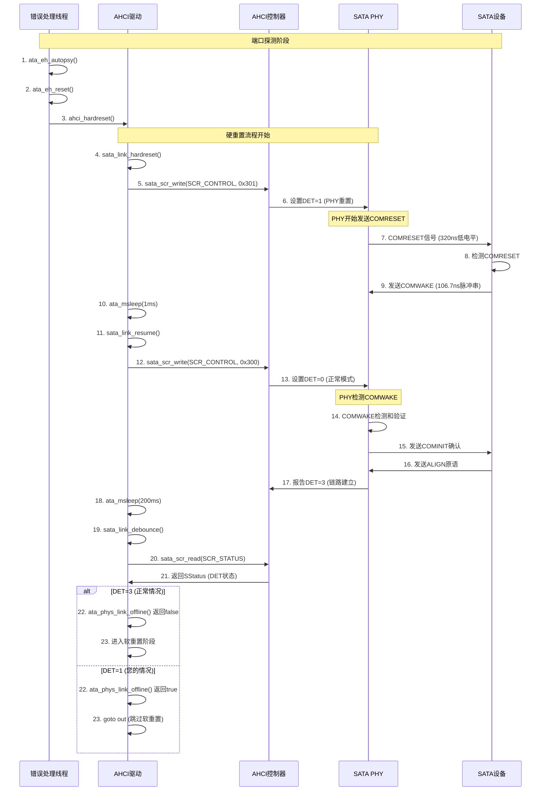
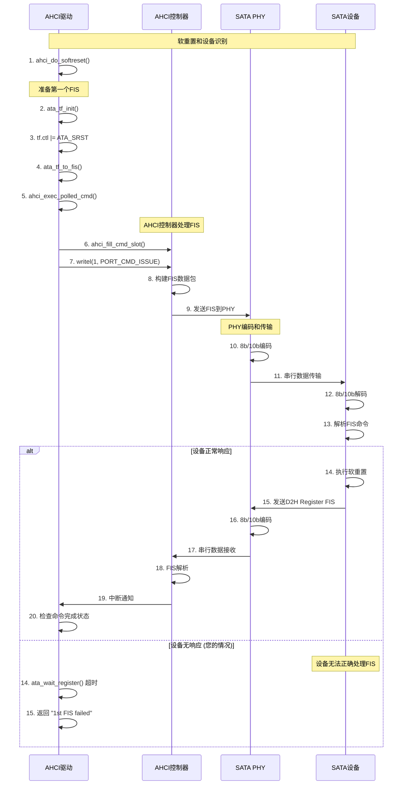
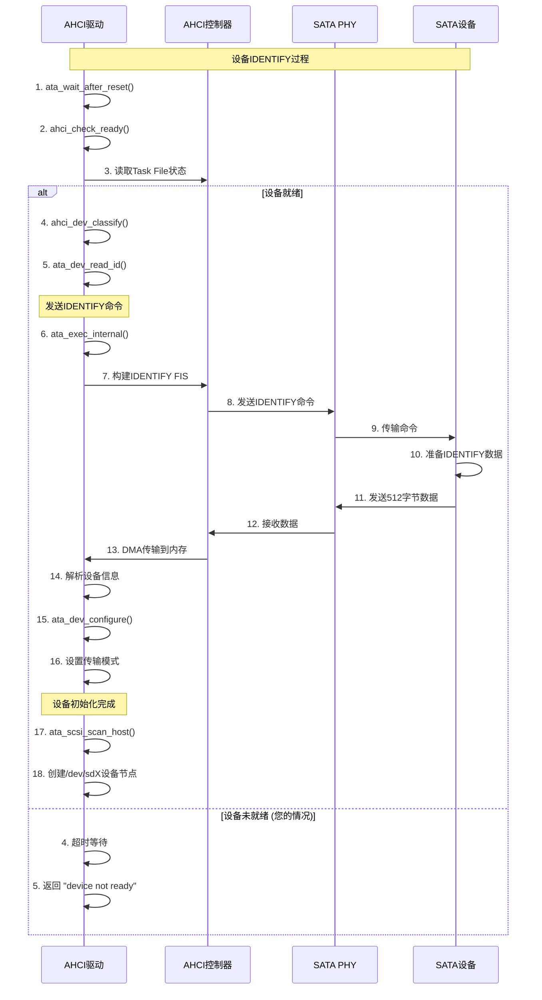
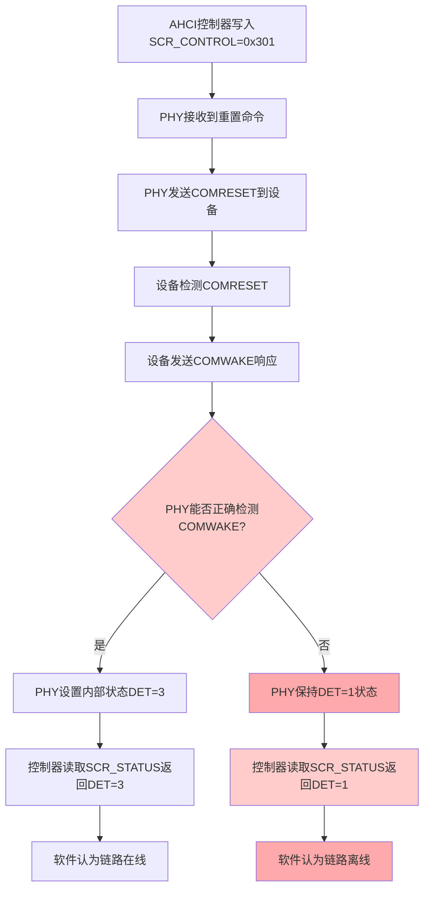

# SATA控制器、PHY、设备三者交互详细流程

## 🏗️ **三层架构概览**



## 📋 **完整交互流程图**

### **阶段1：系统启动和驱动初始化**



### **阶段2：端口探测和PHY链路建立**



### **阶段3：设备识别和软重置**



### **阶段4：设备识别和初始化**



## 🔧 **关键函数调用链详解**

### **硬重置阶段的关键函数**

```c
// 主调用链
ata_eh_reset()
  └── ahci_hardreset()
      └── sata_link_hardreset()
          ├── sata_scr_write(SCR_CONTROL, 0x301)  // 发送COMRESET
          ├── ata_msleep(1)                       // 等待1ms
          └── sata_link_resume()
              ├── sata_scr_write(SCR_CONTROL, 0x300)  // 正常模式
              ├── ata_msleep(200)                     // 等待PHY稳定
              └── sata_link_debounce()
                  └── sata_scr_read(SCR_STATUS)      // 检查DET状态

// 状态检查函数
ata_phys_link_offline()
  └── ata_sstatus_online()
      └── return (sstatus & 0xf) == 0x3;  // 您的PHY这里返回false
```

### **软重置阶段的关键函数**

```c
// 软重置调用链
ahci_do_softreset()
  ├── ata_tf_init()                    // 初始化Task File
  ├── ata_tf_to_fis()                  // 转换为FIS格式
  └── ahci_exec_polled_cmd()
      ├── ahci_fill_cmd_slot()         // 填充命令槽
      ├── writel(PORT_CMD_ISSUE)       // 发送命令
      └── ata_wait_register()          // 等待完成
```

## 🎯 **您的1.5G PHY具体卡住的位置**

### **硬件交互层面**



### **软件层面的判断逻辑**

```c
// 您的PHY在这个流程中失败：
sata_link_hardreset()
  └── sata_link_resume()           // PHY应该在这里转换到DET=3
      └── sata_link_debounce()     // 但实际上保持在DET=1
          └── 返回DET=1到上层
              └── ata_phys_link_offline()
                  └── ata_sstatus_online(SStatus=1)
                      └── return false  // 认为离线!
                          └── 跳过软重置阶段
```

## 💡 **问题本质和解决方向**

### **问题本质**
1. **PHY硬件问题**：无法正确检测或处理设备的COMWAKE信号
2. **软件判断过严**：只认DET=3为在线，不允许DET=1进入软重置
3. **错失测试机会**：因为DET=1被拒绝，无法测试数据通道是否正常

### **解决策略**
1. **短期workaround**：修改软件逻辑，允许DET=1进入软重置测试
2. **中期修复**：调整PHY参数，提高COMWAKE检测能力
3. **长期解决**：根据测试结果决定是否需要硬件重新设计

这个流程图清晰地展示了您的PHY在整个交互过程中的具体失败点，以及各个组件之间的详细交互关系。